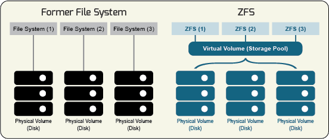
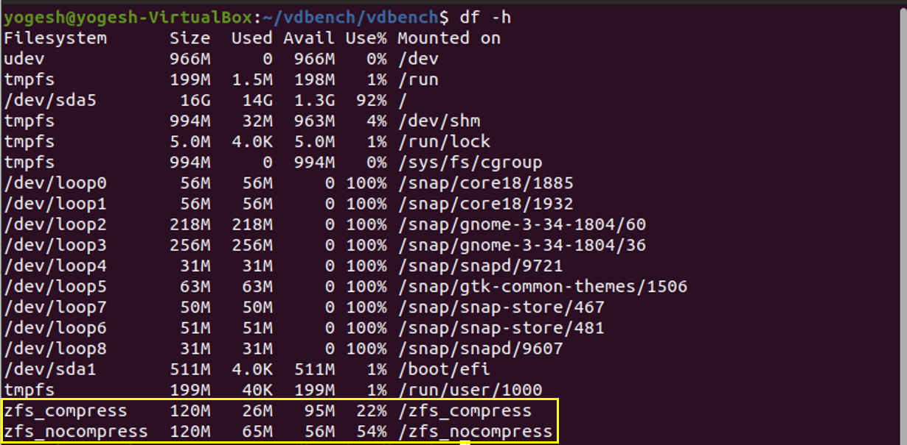
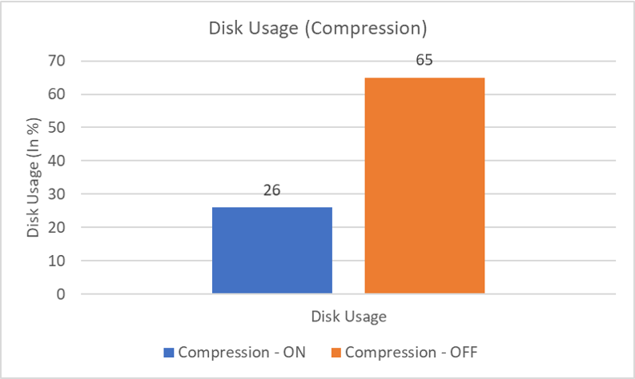
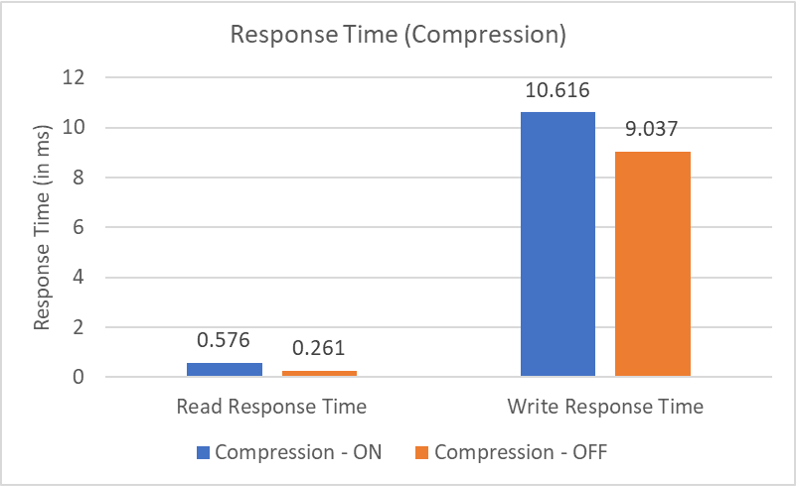
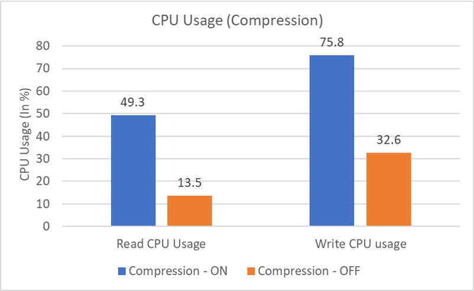
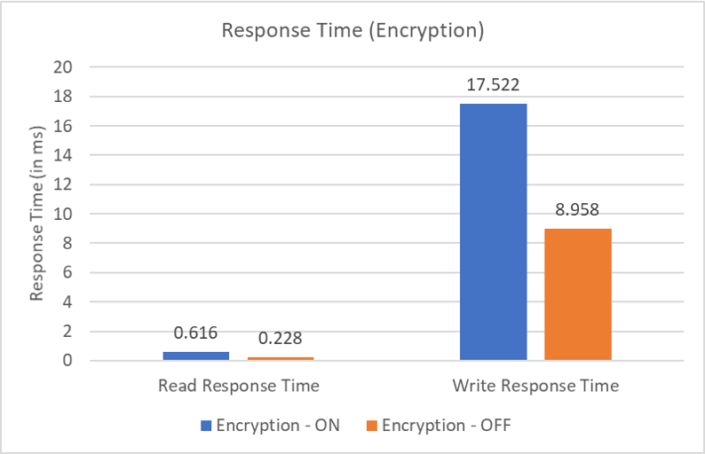
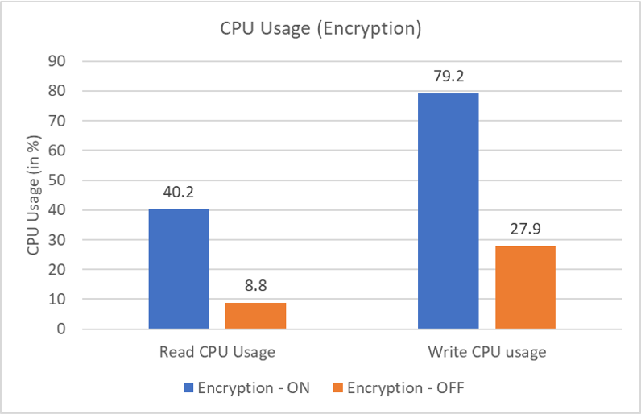

**Important Note -** Imitation of the following experiments requires an environment with *JRE* support and preferably the latest updated and upgraded kernel support for *ZFS* installation.

## ZFS

ZFS combines a file system with a volume manager. It began as part of the Sun Microsystems Solaris operating system in 2001 and later acquired by Oracle. However we have used OpenZFS for this lab. In 2013 OpenZFS was founded to coordinate the development of open source ZFS. OpenZFS maintains and manages the core ZFS code, while organizations using ZFS maintain the specific code and validation processes required for ZFS to integrate within their systems. OpenZFS is widely used in Unix-like systems.

ZFS comes with a lot of features like - 

- Pooled storage
- Copy-on-write
- Snapshots
- Data integrity verification and automatic repair
- RAID-Z
- Maximum 16 Exabyte file size
- Maximum 256 Quadrillion Zettabytes storage
- Compression
- Encryption



## Feature 1 - Compression

The first feature that we have chosen is `compression`. It compresses files on the fly and therefore allowing us to store more data with limited storage.

And we have chosen 2 instances of `ZFS` file system for evaluation:
- with Compression *ON*
- with Compression *OFF*

### Implementation of Compression
ZFS uses the **LZ4** compression algorithm.

LZ4 is a lossless compression algorithm, providing compression speed greater than 500 MB/s per core  (>0.15 Bytes/cycle).  It features an extremely fast decoder, with speed in multiple GB/s per core (~1 Byte/cycle).      

- The LZ4 algorithm represents the data as a series of sequences. Each sequence begins with a one-byte token that is broken into two 4-bit fields.
- The first field represents the number of literal bytes that are to be copied to the output. The second field represents the number of bytes to copy from the already decoded output buffer (with 0 representing the minimum match length of 4 bytes). 
- A value of 15 in either of the bit-fields indicates that the length is larger and there is an extra byte of data that is to be added to the length. 
- A value of 255 in these extra bytes indicates that yet another byte to be added. 
- Hence arbitrary lengths are represented by a series of extra bytes containing the value 255. The string of literals comes after the token and any extra bytes needed to indicate string length. 
- This is followed by an  offset that indicates how far back in the output buffer to begin  copying. The extra bytes (if any) of the match-length come at the end of the sequence.

### Workload for analyzing Compression

**Note -** Refer to file `README.txt` for instructions describing how to run test code. 

Given script was used to create two virtual disk images and installs `ZFS` on each of them, one with compression enabled and one with disabled resp.

```sh
truncate -s 256M ~/zfs_compress.img
truncate -s 256M ~/zfs_nocompress.img

sudo zpool create zfs_compress ~/zfs_compress.img
sudo zfs set compression=lz4 zfs_compress				#Compression algorithm used is lz4
sudo zpool create zfs_nocompress ~/zfs_nocompress.img
sudo zfs set compression=off zfs_nocompress				#Compression disabled
```

To quantify the benefits we have used the following workload - 
```sh
compratio=2.5
fsd=fsd1,anchor=/zfs_compress,depth=2,width=2,files=2,size=8M		#Create the directory structure with depth=2 and width=2
fsd=fsd2,anchor=/zfs_nocompress,depth=2,width=2,files=2,size=8M		#and Create 2 files(8 MB each) into each directory.

#For each virtual disks creates a disk write workload and a disk read workload

#Workload for compression enabled virtual disk
fwd=fwd1_1,fsd=fsd1,operation=write,xfersize=256k,fileio=sequential,fileselect=random,threads=2
fwd=fwd1_2,fsd=fsd1,operation=read,xfersize=256k,fileio=sequential,fileselect=random,threads=2

#Workload for compression disabled virtual disk
fwd=fwd2_1,fsd=fsd2,operation=write,xfersize=256k,fileio=sequential,fileselect=random,threads=2
fwd=fwd2_2,fsd=fsd2,operation=read,xfersize=256k,fileio=sequential,fileselect=random,threads=2

#Run each workload for 10 secs at rate of 100
#Testing on virtual disk images with compression enabled
rd=write_compressed,fwd=fwd1_1,fwdrate=100,format=yes,elapsed=10,interval=1
rd=read_compressed,fwd=fwd1_2,fwdrate=100,format=no,elapsed=10,interval=1

#Testing on virtual disk images with compression disabled
rd=write_uncompressed,fwd=fwd2_1,fwdrate=100,format=yes,elapsed=10,interval=1
rd=read_uncompressed,fwd=fwd2_2,fwdrate=100,format=no,elapsed=10,interval=1
```
### Advantages of Compression

- **Less Space Utilization** - The space utilised for the same amount of data is less. This can be seen by `Disk Usage` column in table and the terminal output below.

- **Less Cost of Storage** - Space occupied is inversely proportional to the cost of storage. Hence, compression leads to lower costs of storage.

- **Less Data Transmission Time** - Space occupied is inversely proportional to the file transfer time. Hence, compression leads to faster file transfers.



<div style="page-break-after: always;"></div>

### Disadvantages of Compression

- **More CPU usage** - Higher CPU usage was observed during reading and writing with compression ON. This is because 
  
    - While writing, the data has to be compressed by the LZ4 compression algorithm. This requires more computation power than write without compression.
    - While reading, the data has to be uncompressed. This requires more computation power than read without compression.
    
    These effects can be observed in `Read CPU Usage` and `Write CPU usage` in table below.

- **More Time** - It takes more time to read and write with compression ON. This is because 

    - While writing, the data has to be compressed by the LZ4 compression algorithm. Some additional time gets utilised for running the algorithm.
    - While reading, the data has to be uncompressed. Some additional time gets utilised for running the algorithm.

    These  effects can be observed in `Read Response Time` and `Write Response Time` in table below.


|                   | Disk Usage | Read Response Time | Read CPU Usage | Write Response Time | Write CPU usage |
| ----------------- | ---------- | ------------------ | -------------- | ------------------- | --------------- |
| Compression - ON  | 26 MB      | 0.576 ms           | 49.3%          | 10.616 ms           | 75.8%           |
| Compression - OFF | 65 MB      | 0.261 ms           | 13.5%          | 9.037 ms            | 32.6%           |



<p float="left">


</p>


## Feature 2 - Encryption

The second feature that we have chosen is encryption. It enables files to be transparently encrypted to protect confidential data from attackers with physical access to the computer.

We have chosen 2 instances of `ZFS` file system for evaluation:

- with Encryption *ON*
- with Encryption *OFF* 

### Implementation of Encryption
ZFS uses the **AES-GCM 256 bit** authenticated encryption algorithm.

`AES-GCM` or Advanced Encryption Standard with Galois Counter Mode is a block cipher mode of operation that provides high speed authenticated encryption and data integrity. It provides high throughput rates for state-of-the-art, high-speed data transfer without any expensive hardware requirements.

The algorithm takes 4 inputs - 
- `Secret key` - Secret key is the cipher key of length 256 bit.  
- `Initialization vector (IV)` - A randomly generated number that is used along with a secret key for data encryption 
- `Unencrypted text` - This is the plain-text that has to be encrypted
- `Additional Authenticated Data (AAD)` - It is a string that can be used later on to decrypt the encrypted data. It is like a password which when later given, can decrypt the data

The algorithm gives 2 output - 
- `Message Authentication Code (MAC or Tag)` - The code is a short piece of information used to authenticate a message. It can be used later on for authentication of the user
- `Cipher Text` - This is the encrypted text that the algorithm output


The data is considered as a series of blocks of size 128 bits. Blocks are numbered sequentially, and then this block number is combined with an initialization vector and encrypted with the `Secret key`. The cipher-text blocks are considered coefficients of a polynomial which is evaluated at key-dependent points, using finite field arithmetic. The result is then XORed with the unencrypted text, to produce the final cypher text and the Message Authentication Code. A random or arbitrary `Initialization vector` is required for each encryption or else it would result in a less secure cipher-text. 

### Workload for analysing Encryption

**Note -** Refer to file `README.txt` for instructions describing how to run test code. 

Given script was used to create two virtual disk images and install `ZFS` on each of them, one with encryption enabled and one with disabled resp.

```sh
truncate -s 256M ~/zfs_encrypt.img
truncate -s 256M ~/zfs_noencrypt.img

sudo zpool create zfs_noencrypt ~/zfs_noencrypt.img														#Encryption disabled

sudo zpool create zfs_encrypt ~/zfs_encrypt.img
echo "12345678" | sudo zfs create -o encryption=on -o keyformat=passphrase zfs_encrypt/encrypted		#Encryption enabled
```

To quantify the benefits we have used the following workload - 
```shell
fsd=fsd1,anchor=/zfs_encrypt/encrypted,depth=1,width=1,files=8,size=8M		#Creates 8 files each of size 8MB on both the virtual
fsd=fsd2,anchor=/zfs_noencrypt,depth=1,width=1,files=8,size=8M				#disks. Single directory used

#For each virtual disks creates a disk write workload and a disk read workload
#Each workload uses files created above

#Workload for encryption enabled virtual disk
fwd=fwd1_1,fsd=fsd1,operation=write,xfersize=256k,fileio=sequential,fileselect=random,threads=2	#Writes in chunks of 256KB
fwd=fwd1_2,fsd=fsd1,operation=read,xfersize=256k,fileio=sequential,fileselect=random,threads=2	#Reads in chunks of 256KB

#Workload for encryption disabled virtual disk
fwd=fwd2_1,fsd=fsd2,operation=write,xfersize=256k,fileio=sequential,fileselect=random,threads=2	
fwd=fwd2_2,fsd=fsd2,operation=read,xfersize=256k,fileio=sequential,fileselect=random,threads=2

#Run each workload for 10 secs at rate of 100
rd=write_encrypted,fwd=fwd1_1,fwdrate=100,format=yes,elapsed=10,interval=1
rd=read_encrypted,fwd=fwd1_2,fwdrate=100,format=no,elapsed=10,interval=1
rd=write_unencrypted,fwd=fwd2_1,fwdrate=100,format=yes,elapsed=10,interval=1
rd=read_unencrypted,fwd=fwd2_2,fwdrate=100,format=no,elapsed=10,interval=1
```
### Advantages of Encryption

- **Prevents Unauthorized Access** - It provides the ability to prevent unauthorized users from accessing certain files on networks or shared computers. This happens without barring those users from accessing other files on the disk.
- **Enhances Data Integrity** -  Encryption keeps your data safe from alterations, and recipients of the data will be able to see if it has been tampered with.

### Disadvantages of Encryption

- **Risk of losing data** - If the user forgets his password, data can not be recovered by any means.

- **More CPU usage** - With encryption *ON*, CPU usage observed was much higher while reading and writing. This is because 
  
    - Everytime the data is written, it has to be encrypted by the AES-GCM encryption algorithm. This requires much more computation power than writing without encryption.
    - Everytime the data is read, it has to be decrypted by the algorithm. This requires much more computation power than reading without encryption.
    
    These effects can be observed in `Read CPU Usage` and `Write CPU usage` in table below.
    


- **More Time** - With encryption *ON*, running time observed was much higher while reading and writing. This is because 
  
    - Everytime the data is written, it has to be encrypted by the AES-GCM encryption algorithm. Some additional time gets utilised for running the computationally heavy Encryption algorithm.
    - Everytime the data is read, it has to be decrypted by the algorithm. Some additional time gets utilised for decrypting the cypher-text.
    
    These  effects can be observed in `Read Response Time` and `Write Response Time` in table below.


|                  | Read Response Time | Read CPU Usage | Write Response Time | Write CPU usage |
| ---------------- | ------------------ | -------------- | ------------------- | --------------- |
| Encryption - ON  | 0.616 ms           | 40.2 %         | 17.522 ms           | 79.2 %          |
| Encryption - OFF | 0.228 ms           | 8.8 %          | 8.958 ms            | 27.9 %          |



