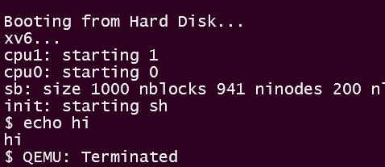

### **Part A: Lazy Allocation**

We started Part A with the patch provided which just tricks the process into believing that it has the memory which it requested by updating the value of `proc->sz` (the size of the process) while not actually allocating any physical memory by commenting the call to `groproc(n)` in `sysproc.c`.

This means that any access to the above requested memory results in a page fault as in reality no such memory has been provided and hence, it is an illegal reference. Our lazy allocator in such cases of page faults allocates one page from the free physical memory available to the process and also updates the page table about this new allocation. 


#### Handling the Page Fault

Since xv6 does not handle page faults by default, we added the case when trap caused is due to a page fault and called our handler function `allocSinglePg(...)` which actually performs the task of allocation, with the required paramenters.

```c
  // trap.c
  case T_PGFLT:				// line 80
    allocSinglePg(myproc()->pgdir, rcr2());
    break;
```

- `myproc()->pgdir` returns a pointer to the page directory of the process which is outer level of the 2-level page table in xv6 .
- The function `rcr2()` returns the the virtual address which caused the page fault.

#### Allocating a new page

The allocation of page and updation the page table is done in `allocSinglePg(...)` in `vm.c`:

```c
  // vm.c
  void allocSinglePg(pde_t *pgdir, uint va) { // line 252
    uint a = PGROUNDDOWN(va);
    char *mem = kalloc();
    // ...
    
    memset(mem, 0, PGSIZE);
    if(mappages(pgdir, (char*)a, PGSIZE, V2P(mem), PTE_W|PTE_U) < 0){
      cprintf("allocuvm out of memory (4)\n");
      kfree(mem);
    }
  }
```

- First, it aligns the virtual address to the start of a page using `PGROUNDDOWN(...)` because that is the proper starting virtual address to which physical memory will be mapped.
- Second, it uses `kalloc()` which returns the physical memory from the free list.
- Next, if allocation was successful (memory was available and allocated), it is filled with 0s. 
- Finally, `mappages(...)` is called which uses `pgdir` to locate (and create, if required) the page table contained the corresponding virtual address `a` and creating a corresponding page table entry (only a single entry in our case as we want `PGSIZE` amount of memory) having physical address `P2V(mem)`, as obtained above with the permissions set to writable(`PTE_W`) and user process accessible(`PTE_U`).
- In case of failure in `mappages(...)`, aquired memory `mem` is freed using `kfree(mem)`.

#### Sample output 



---
## **Part B**: 

Refer the patch files in `Patch/PartB/`. The main code for this part is in files `paging.h` and `paging.c`

#### Task 1: kernel processes:

Function `create_kernel_process()` is defined in `proc.c` which creates a kernel process and add it to the processes queue. The function first finds an empty slot in the process table and assigns it to the newly created process. Then it allocates kernel stack for the process, sets up `trapframe` ,  puts the `exit()`function which will be called upon return from context after `trapframe` in stack , sets up context and its `eip` is made equal to `entrypoint` function. Then the page table for the new process is created by calling `setupkvm()` , the name of the process is set as the input argument `name`  and `intproc` is made as its parent. Finally the state of process is changed to `RUNNABLE` .

```c
// proc.c
void create_kernel_process(const char *name, void (*entrypoint)()) {
  struct proc *p;
  char *sp;
	acquire(&ptable.lock);
  
  //... find empty slot in ptable
  
  p->state = EMBRYO;
  p->pid = nextpid++;

  release(&ptable.lock);

  // Allocate kernel stack.
  if((p->kstack = kalloc()) == 0){
    p->state = UNUSED;
    return;
  }
  sp = p->kstack + KSTACKSIZE;

  // Leave room for trap frame.
  sp -= sizeof *p->tf;
  p->tf = (struct trapframe*)sp;

  // Set up new context to start executing at entrypoint, which returns to kernexit.
  sp -= 4;
  *(uint*)sp = (uint)exit;		 // end the kernel process upon return from entrypoint()

  sp -= sizeof *p->context;
  p->context = (struct context*)sp;
  memset(p->context, 0, sizeof *p->context);
  p->context->eip = (uint)entrypoint;

  if((p->pgdir = setupkvm()) == 0) panic("kernel process: out of memory?");

  p->sz = PGSIZE;
  p->parent = initproc;
  p->cwd = idup(initproc->cwd);
  safestrcpy(p->name, name, sizeof(p->name));

  acquire(&ptable.lock);
  p->state = RUNNABLE;
  release(&ptable.lock);
}
```

Upon return from the `entrypoint()` .The `exit()` function will terminate the process and thereby preventing it to return to `user mode` from `kernel mode` . The `create_kernel_process()` function is called in `forkret` (only when `forket` is called from `initprocess`) to create two `kernel processes` namely `swapoutprocess` and `swapinprocess` .

```c
// proc.c
void forkret(void) {
	// ...
  if (first) {
    // ...
    create_kernel_process("swapoutprocess",swapoutprocess);
    create_kernel_process("swapinprocess" ,swapinprocess);
  }
}
```

<div style="page-break-after: always;"></div>

---
#### Task 2: swapping out mechanism:

Two new elements are added to the process structure to store swapping meta data. The variable `trapva` stores the virtual address where page fault has occurred for the given process. The variable `satisfied` is used as indication whether a swap out request has been satisfied for the given process.

```c
// proc.h
struct proc {
  ///...
  int satisfied;               // If zero, page request not satisifed
  uint trapva;                 // VA at which pagefault occurred
};
```

The newly created kernel process `swapoutprocess` is responsible for swapping out of pages on demand.  `swappoutprocess` supports a request queue for the swapping requests which is created from the `struct swapqueue` .

```c
// paging.h
struct swapqueue{
  struct spinlock lock;
  char* qchan;
  char* reqchan;
  int front;
  int rear; 
  int size;  
  struct proc* queue[NPROC+1];
};
```

An instance `soq` of the `struct swapqueue` is used as a request queue for the `swapoutprocess` . Any access to the `swapqueue` is protected by a `spinlock` . The `enqueue()` and `dequeue()` for the `swapqueue` are also created.

```c
// paging.c
void enqueue(struct swapqueue* sq, struct proc* np); // insert process at rear of queue
struct proc* dequeue(struct swapqueue* sq);					 // take out process from front of queue
```

The request to swap out a page is submitted by calling `submitToSwapIn()` function which adds the process structure pointer of the requesting process to the `siq` queue, wakes the `swapoutprocess` and makes the current (requesting) process to sleep until its `satisfied` bit is turned on ie suspends its from execution.  

<div style="page-break-after: always;"></div>

```c
// paging.c
void submitToSwapOut(){
  struct proc* p = myproc();
  
  acquire(&ptable.lock);
  acquire(&soq.lock);
  p->satisfied = 0;   
  enqueue(&soq, p);   // Enqueues the process in the Swapout queue
  wakeup1(soq.qchan); // Wakes up the Swapout process
  release(&soq.lock);

  while(p->satisfied==0)  // Sleep process till not satisfied 
    sleep(soq.reqchan, &ptable.lock);
  release(&ptable.lock);
}
```

The `entrypoint` of `swapoutprocess` is `swapoutprocess()` which sleeps whenever the size of request queue is zero. Whenever there are requests for swap out the `swapoutprocess` process wakes up and iterates over the requests treating them one by one and upon freeing the required number of physical pages the `swapoutproces` wakes all the requesting processes. The function `chooseVictimAndEvict()` is used to select victim frame using pseudo `LRU` replacement policy. The `swapoutprocess()` contains check on number of files created and yields the processor when the number reaches the upper bound so that in the mean time some files can be deleted by `swapinprocess` . It also handles the edge case when no victim frame could be evicted by temporarily yielding the processor. While doing all this, appropriate `locks` are acquired and released, so as to handle synchronization issues.


```c
// paging.c
void swapoutprocess(){
  sleep(soq.qchan, &ptable.lock);

  while(1){
    acquire(&soq.lock);
    while(soq.size){
      // ...Edge case handling
      struct proc *p = dequeue(&soq); // Dequeue process from queue
      
      if(!chooseVictimAndEvict(p->pid)){
         // ...Edge case handling
      }
      p->satisfied = 1;     // When frame found set satified to true
    }

    wakeup1(soq.reqchan);   // Wake the corresponding process
    release(&soq.lock);
    sleep(soq.qchan, &ptable.lock);
  }
}
```

In the function `chooseVictimAndEvict()` we iterate over address space of all the user processes currently present in the `ptable` in multiples of page size so as to visit each page of all user processes once.

**Pseudo LRU** replacement policy is used for selecting the victim frame. For each page table entry the accessed bit and dirty bit are concatenated to form an integer, the victim frame is selected based on the integer and preference order is as 0(00) < 1(01) < 2(10) < 3(11). Once a victim frame is chosen, the present bit is turned off for the corresponding page table entry and the corresponding process is made to sleep until writing on disk is complete. The 7<sup>th</sup> bit(initially unused) of the page table entry is also turned on which indicates that the required frame has been swapped out. Upon successful eviction of victim frame, value 1 is returned else 0 is returned.

```c
// paging.c
int chooseVictimAndEvict(int pid){
  struct proc* p;
  struct victim victims[4]={{0,0,0},{0,0,0},{0,0,0},{0,0,0}};
  pde_t *pte;
  for(p = ptable.proc; p < &ptable.proc[NPROC]; p++){
      if(p->state == UNUSED|| p->state == EMBRYO || p->state == RUNNING || p->pid < 5|| p->pid == pid)
        continue;
    
     // ...Finding victim frame
  }
  
  for(int i=0;i<4;i++){
    if(victims[i].pte != 0){
      // ...Update flags in victim's PTE
      
      if(victims[i].pr->state != ZOMBIE){
        release(&soq.lock);
        release(&ptable.lock);
        write_page(victims[i].pr->pid, (victims[i].va)>>12, (void *)P2V(PTE_ADDR(reqpte)));   // swap out victim's frame
        acquire(&soq.lock);
        acquire(&ptable.lock);
      }
      kfree((char *)P2V(PTE_ADDR(reqpte))); // Add freed frame to freelist
      //...
      return 1;
    }
  }
  return 0;
}
```

The `kalloc()` function which is used to allocate one 4096-byte page of physical memory is changed to meet demand swapping . The function `submitToSwapOut()` is called inside a loop until a free page of physical memory is obtained.

<div style="page-break-after: always;"></div>

```c
// kalloc.c
char* kalloc(void) {
  // ...
  while(!r) {
    if(kmem.use_lock) release(&kmem.lock);
    submitToSwapOut();
    if(kmem.use_lock) acquire(&kmem.lock);
    r = kmem.freelist;
  }
  // ...
}
```

`write_page()` is used to write the victim frame content in the disk . The file name is chosen as *PID_VA.swp* where PID is of the process whose page is chosen as victim and VA is higher 20 bits of virtual address corresponding to the evicted page.  `write_page()` uses `open_file()` to open/create files and `filewrite()`  to write the content in the given file.


---
#### Task 3: Swapping in Mechanism:

**Swap-in Process** -  

- The entrypoint of Swap-in Process is `swapinprocess()`. Whenever there are requests for swaping in pages, the Swap-in Process is woken up. 

- It then iterates in the Swapin queue and one-by-one satisfies the requests. It first calls `kalloc()` to get a free frame in the physical memory. Then it reads the swapped-out page from the disk into the free frame. Then `swapInMap()` is called, which updates the flags and Physical Page Number (PPN) in the appropriate `Page Table Entry (PTE)`. Then the corresponding process is woken up.

- After satisfying all the requests in its queue, the Swap-in Process goes into SLEEPING state. While doing all this, appropriate `locks` are acquired and released, so as to handle synchronization issues.

- `read_page()` reads the file corresponding to swapped out page of the respective process's PTE into the buffer `mem`. It first computes the filename and then calls the inbuilt function `fileread()` to read the contents of the file.

```c
// paging.c
void swapinprocess(){
  sleep(siq.qchan, &ptable.lock);
  while(1){
    acquire(&siq.lock);
    while(siq.size){
      struct proc *p = dequeue(&siq); // request at the front of the Swapin queue
      release(&siq.lock);
      release(&ptable.lock);
      
      char* mem = kalloc();	 				  // free physical frame is obtained
      read_page(p->pid,((p->trapva)>>12),mem); // Read the page into it
      
      acquire(&siq.lock);
      acquire(&ptable.lock);
      swapInMap(p->pgdir, (void *)PGROUNDDOWN(p->trapva), PGSIZE, V2P(mem));  // Update the PTE
      wakeup1(p->chan);
    }
    release(&siq.lock);
    sleep(siq.qchan, &ptable.lock);
  }
}

```

Whenever a `page fault` occurs, we are checking if it has occurred due to an earlier swapping out of its page, and then we are calling the function `submitToSwapIn()`. It enqueues the current process in the Swapin queue, wakes up the Swapin process and finally suspends the current process. While doing this, appropriate locks are acquired and released.

```c
// paging.c
void submitToSwapIn(){
  struct proc* p = myproc();
  cprintf("submitToSwapIn %d\n",p->trapva);

  acquire(&siq.lock); 
  acquire(&ptable.lock);
  enqueue(&siq, p);   // Enqueues the current process in the Swapin queue
  wakeup1(siq.qchan); // Wake up the Swapin process
  release(&siq.lock);
  
  sleep((char *)p->pid, &ptable.lock);  // Suspend the current process
  release(&ptable.lock);
  return;
}
```

When the process exits, we make sure that the Swapout pages written on the disk are deleted. To do this, we have called `deletePageFiles()`.
**deletePageFiles** - It iterates through the files list of the `swapoutprocess`, and if the file is not already deleted, it deletes it. While doing this, appropriate locks are acquired and released.

<div style="page-break-after: always;"></div>

```c
// paging.c
void deletePageFiles(){
  acquire(&ptable.lock);
  struct proc *p;
  for(p = ptable.proc; p < &ptable.proc[NPROC]; p++){
    if(p->state == UNUSED) continue;
    if(p->pid==2||p->pid==3) {
      for(int fd = 0; fd < NOFILE; fd++){ // Iterating through the files list
        if(p->ofile[fd]){
          struct file* f = p->ofile[fd];

          // ...Check if the file is already deleted
          
          release(&ptable.lock);
          delete_page(p->ofile[fd]->name); // Deleting the file
          fileclose(f);
          p->ofile[fd] = 0;
          acquire(&ptable.lock);
        }
      }
    }
  }
  release(&ptable.lock);
}
```

---

#### Task 4: Sanity Test

Our user program `memtest.c` forks *20 child processes*, each of which *iterates 20 times*, and each time *requests 4096 Bytes* using `malloc()`.

For the *i<sup>th</sup> child process*, in the *j<sup>th</sup> iteration*, the *k<sup>th</sup> byte* is set with the following function:

```c
  child_iter_byte[i][j][k] = ( i + j*k ) % 128
```

Every child process first iterates 20 times setting the byte values, after which it again iterates 20 times, comparing the stored value with the expected value, again computed using the above function.

*Note:* Each child is iterating 20 times in place of 10 times (as mentioned in assignment), because iterating for 10 times, doesn't cause the complete main memory to be used up. This main memory limit, set with `PHYSTOP` cannot be set below `4MB` (due to initialisation requirements of the kernel), at which we need to iterate for more than 10 times for each child process to actually test the correctness of our swapper.

<div style="page-break-after: always;"></div>


### **Sample Output :**

