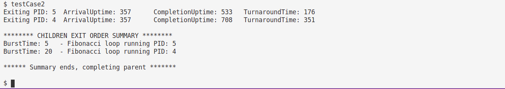
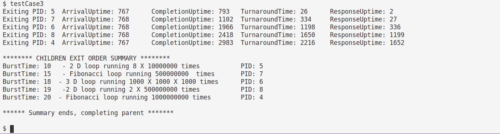
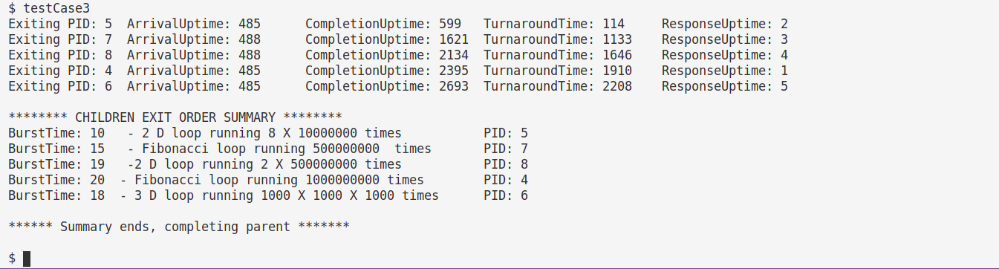
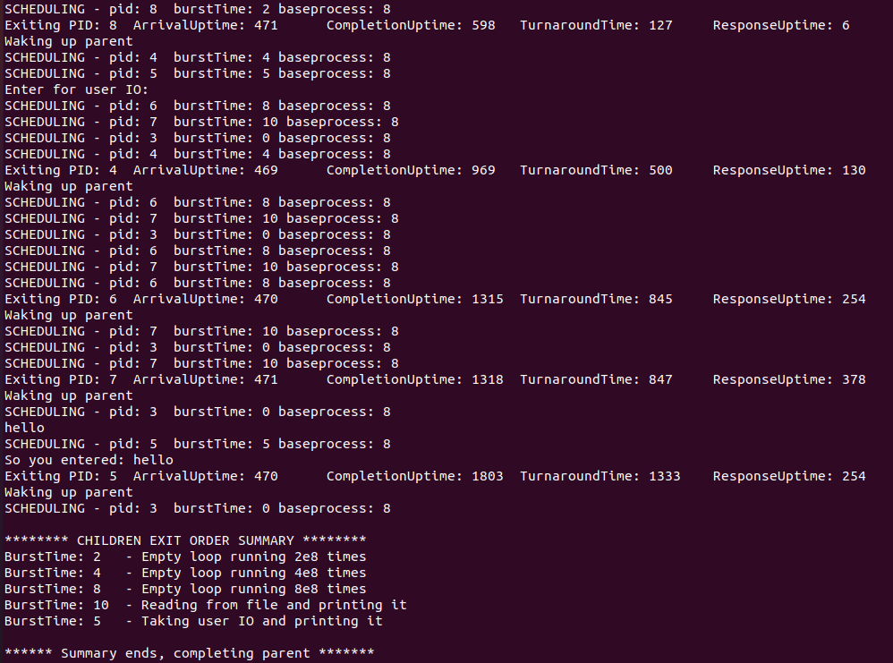

## **Part A**: 

Refer the patch files in `Patch/PartA/`

For creating the system calls, we needed to change these files:- 
* `user.h `- The function prototypes of our system calls (for user-space) were added in this file at line 27
* `defs.h `- The function prototypes of our system calls (for kernel-space) were added in this file at line 124
* `syscall.h `- The mapping from system call names to system call numbers were added in this file at line 23
* `syscall.c `- The mapping from system call numbers to system call functions were added in this file at line 106 and line 134
* `usys.S `- The system call names were added in this file at line 32
* `proc.h `- 2 extra fields ie. `int numcs` and `burstTime` were added in the struct `proc` to keep track the number of context switches and burst time of the process 
* `sysproc.c `- The definition of system calls were added in this file and the file `processInfo.h` was included
* `proc.c `- Since the struct `ptable` and other utility functions for process management were in this file, the main code for system calls was added in this file

### **Syscall getNumProc** 

Function `sys_getNumProc(void)` was defined in file `sysproc.c` at line 95, which calls the function `getNumProc()` defined in `proc.c` and returns the value returned by it. 

The function `getNumProc` contains the main code for this syscall can be found in the file `proc.c` at line 546. We have looped through all the slots of the `ptable's proc array` of the  and incremented the counter whenever we find a proc slot with a state other than UNUSED. Before iterating through the `proc` array we acquired the lock and released it after it. This is done to ensure that another process doesn't modify the ptable while we are iterating through it.  

```C
// proc.c
int                                         // line 546                     
getNumProc(void)
{
	int c = 0;
	struct proc *p;
	acquire(&ptable.lock);
	for(p = ptable.proc; p < &ptable.proc[NPROC]; p++){
		if(p->state != UNUSED)
		c++;
	}
	release(&ptable.lock);
	return c;
}
```
---


### **Syscall getMaxPid**
Function `sys_getMaxPid(void)` was defined in file `sysproc.c` at line 103, which calls the function `getMaxPid()` defined in `proc.c` and returns the value returned by it.

The function `getMaxPid` contains the main code for this syscall can be found in the file `proc.c` at line 563. We have looped through all the slots of the `proc` array of the `ptable` and found the maximum of all the process with a state other than UNUSED. Before iterating through the `proc` array we acquired the lock and released it after it. This is done to ensure that another process doesn't modify the ptable while we are iterating through it.  
```C
// proc.c
int                                         // line 563               
getMaxPid(void)
{
	int maxPID = -1;
	struct proc *p;
	acquire(&ptable.lock);
	for(p = ptable.proc; p < &ptable.proc[NPROC]; p++){
		if(p->state != UNUSED && p->pid > maxPID)
		maxPID = p->pid;
	}
	release(&ptable.lock);
	return maxPID;
}
```
---
### **Syscall getProcInfo**

We added an extra field `numcs` in the struct `proc` to keep track of the number of context switches of a process

 <br/>

```C
// proc.h
int numcs;                                    // line 52             
```
We have initialized the `numcs` field of a process to 0 in the function `allocproc()`. This function is called while creating a process and hence, is called only once for a process.
```C
// proc.c
p->numcs = 0;                                 // line 95             
```
We have incremented the `numcs` field of a process everytime the scheduler schedules that process.
```C
// proc.c
p->numcs++;                                   // line 351             
```
Function `sys_getProcInfo(void)` was defined in file `sysproc.c` at line 112. It first gets the `pid` and `processInfo` struct pointer using `argint` and `arptr` resp. Then  calls the function `getProcInfo(pid, pi)` defined in `proc.c` and returns the value returned by it.
```C
// sysproc.c
int                                         // line 112
sys_getProcInfo(void)
{
  int pid;
  struct processInfo* pi;
  if(argint(0, &pid) < 0) return -1;
  if(argptr(1, (void*)&pi, sizeof(pi)) < 0) return -1;
  return getProcInfo(pid, pi);
}
```

The function `getProcInfo` contains the main code for this syscall can be found in the function file `proc.c` at line 580. We have linearly searched for the PID in the `proc` array of the `ptable` and copied the required information into the struct `processInfo` from the struct `proc`. It returns 0 if PID is found and -1 otherwise. Before iterating through the `proc` array we acquired the lock and released it after it. This is done to ensure that another process doesn't modify the ptable while we are iterating through it.  

```C
// proc.c
int                                         // line 580             
getProcInfo(int pid, struct processInfo* pi)
{
  struct proc *p = 0;
  int found = 0;
  acquire(&ptable.lock);
  for(p = ptable.proc; p < &ptable.proc[NPROC]; p++){
    if(p->state != UNUSED && p->pid == pid){
        pi->ppid = p->parent->pid;
        pi->psize = p->sz;
        pi->numberContextSwitches = p->ncs;
        found = 1;
        break;
      }
  }
  release(&ptable.lock);
  if(found) return 0;
  return -1;
}
```

---

### **Syscall get_burst_time**

We added an extra field `burstTime` in the struct `proc` to keep track of the burst time of the process.

```C
// proc.h
int burstTime;                                // line 53            
```
We have initialized the `burstTime` field of a process to 0 in the function `allocproc()`. This function is called while creating a process and hence, is called only once for a process.

<br/>

```C
// proc.c
p->burstTime = 0;                             // line 96             
```

Function `sys_get_burst_time(void)` was defined in file `sysproc.c` at line 125, which calls the function `get_burst_time()` defined in `proc.c` and returns the value returned by it.

The function `get_burst_time` contains the main code for this syscall can be found in the file `proc.c` at line 602. Since we have already mantained the burst time in the struct `proc`, we simply use the pointer to the currently running process which is returned by myproc(), with which we read the burstTime property of the process.
```C
// proc.c
int											                    // line 602
get_burst_time()
{
  return myproc()->burstTime;
}
```
---

### **Syscall set_burst_time**

Function `sys_set_burst_time(void)` was defined in file `sysproc.c` at line 134. It first gets the argument burstTime `btime` using `argint`, then calls the function `set_burst_time(btime)` defined in `proc.c` and returns the value returned by it.
```C
// sysproc.c
int                                         // line 134
sys_set_burst_time(void)
{
  int btime;
  if(argint(0, &btime) < 0) return -1;
  return set_burst_time(btime);
}
```

The function `set_burst_time` contains the main code for this syscall can be found in the file `proc.c` at line 611. We first confirm that the burst time being set is positive (othewise return error status) then use the pointer to the currently running process which is returned by myproc(), with which we set the `burstTime` field of the process.
```C
// proc.c
int											  // line 611
set_burst_time(int n)
{
  // Burst Time should be a positive integer
  if (btime < 1)
    return -1;

  myproc()->burstTime = btime;
  return 0;
}
```
---

## **User-level Application for our System Calls**
For testing our system calls, we created 4 user-level applications -
* `numProcTest` for testing `getNumProc()`  
* `maxPidTest` for testing `getMaxPid()`  
* `procInfoTest` for testing `getProcInfo()`
* `getSetBTime` for testing both `get_burst_time()` and `set_burst_time()` 

For creating the user-level application, we need to make some changes in the `MakeFile` and create the `c` files for the user-level application.

In `Patch/PartA/Makefile` we need to add our user-level applications to `UPROGS` and `EXTRA	`.

```makefile
// Makefile
	_numProcTest\                                                                            # line 184
	_maxPidTest\
	_procInfoTest\     
  	_getSetBTime\                                                         
	
EXTRA=\
	mkfs.c ulib.c user.h cat.c echo.c forktest.c grep.c kill.c\
	ln.c ls.c mkdir.c rm.c stressfs.c usertests.c wc.c zombie.c\
	printf.c umalloc.c numProcTest.c maxPidTest.c procInfoTest.c getSetBTime.c\          		# line 257
	
```

### **numProcTest** 
We created `numProcTest.c` in which we simply printed the output of the system call `getNumProc` to the console using `printf`. 1st parameter in `printf` is file descriptor which is 1 for console out. At the end we used `exit` system call to exit from this program.


### **maxPidTest** 
We created `maxPidTest.c`in which we simply printed the output of the system call `getMaxPid` to the console. At the end we used `exit` system call to exit from this program.

### **procInfoTest** 
We created `procInfoTest.c` in which we use the syscall getMaxPid to get the Max PID, then use the system call `getProcInfo` to get Info about the process with that PID and then print the values of the fields of the struct `processInfo` to the console. We included `processInfo.h` as we are using the struct `processInfo`. At the end we used `exit` system call to exit from this program.

### **getSetBTime**
We created `getSetBTime.c` in which we first print the current burst time for this process (whose default value is 0), using the system call `get_burst_time`. Then we take user input for the new burst time to be set and after some validation use this input to set the new burst time using the system call `set_burst_time`, while passing the new value. Finally, we again use `get_burst_time` to demostrate that the burst time has indeed been set correctly.


---

## **Part B (Shortest Job First Scheduler)**  

Refer the patch files in `Patch/PartB/` for detailed code.

### **Scheduler Implementation**

This part require the default number of CPUs to simulate to be changed to 1. It was achieved by changing the constant `NCPU` to 1 in `param.h`

```C
//param.h
#define NCPU 1                              // line 3
```

The default scheduler of `xv6` was an unweighted round robin scheduler which preempts the current process after running it for certain fixed time (indicated by an _interrupt_ from _hardware timer_). But the required scheduler needs to be Shortest Job First scheduler, so it was required to disable this preemption. It was achieved by commenting the following code from the file `traps.c`

<br/>

```c
// trap.c

// if(myproc() && myproc()->state == RUNNING &&        // line 105
//    tf->trapno == T_IRQ0+IRQ_TIMER)
//      yield();
```
Since the burst time of a process was set by the _process itself_, so after setting up burst time the context needs to be switched back to the scheduler. To achieve this `yield` function was called (the currently running process is made to yield CPU) at the end of `set_burst_time()` in `proc.c`

```c
// proc.c
int                                         // line 686
set_burst_time(int n)
{
  myproc()->burstTime = n;
  yield();
  return 0;
}
```

**Time Complexity:** For implementing shortest job first scheduling the Ready Queue was implemented as a Priority Queue  (min heap) so that finding the job with shortest burst time and inserting a new job into the list could be done in `O(log n)` where `n` is the number of processes in the ready queue. 

**Implementation:**  Refer to patch for detailed code.

In `proc.c` two new fields were added to `ptable` structure ie. the `priorityQueueArray`, which would store the pointers of the processes in the form of a min heap and `pqsize`, which is equal to the size of the ready queue at any point of time.

```c
// proc.c
struct {
  struct spinlock lock;
  struct proc proc[NPROC];
  struct proc* priorityQueueArray[NPROC];             // min Heap array
  int pqsize;                                         // size of Priority Queue
} ptable;
```

The Utility functions for Priority Queue were implemented in the file `proc.c` from line 18 to line 90.
```c
int compProc(struct proc* proc1,struct proc* proc2)     // compares 2 processes based on there burst time
void swap(int i,int j)                                  // swaps 2 processes present in ptable
void priorityQueueHeapify(int curIndex)                 // helper heapify function used to implement a min heap
struct proc* priorityQueueExtractMin()                  // returns process with min burst time and removes it from Priority Queue
void priorityQueueInsert(struct proc* proc)             // inserts a process in the Priority Queue
```


The function `scheduler` also needed to be changed as follows. 

```C
void
scheduler(void)
{
  struct proc *p;
  ...
  for(;;){
    ...  // Choose a process from ready queue to run
    acquire(&ptable.lock);
    p = priorityQueueExtractMin();     // Find the process with minimum Burst Time using Priority Queue

    if(p==0) {  // No process is curently runnable
      release(&ptable.lock);
      continue;
    }
    ...
    release(&ptable.lock);
  }
}
```

We first get the process with the minimum burst time from the Ready Queue using the `priorityQueueExtractMin()` function. If there is no runnable process, we release the lock and continue back. For each iteration of outer `for` loop, the pointer to the process with minimum burst time is extracted out of the Priority Queue. Since Priority is based upon burst time of processes, so the required process will be the min element of Priority Queue, hence function `priorityQueueExtractMin()` will return the same. If no runnable process exists then the NULL (or 0) pointer is returned and this corner case is handled separately in `if` block above. If the Ready Queue is non empty then the context is switched to the required process. 


Whenever a process was made RUNNABLE, it was _inserted_ in the Ready Queue. 
The important places in which we added a process to the Ready Queue were the following: 
* `fork()` - The newly created RUNNABLE process was added to Ready Queue here
  ```c
  int fork(void){
    ...
    acquire(&ptable.lock);
    np->state = RUNNABLE;
    priorityQueueInsert(np);
    release(&ptable.lock);
    ...
  }
  ```
* `yield()` - The currently running process was made to yield CPU thereby making it RUNNABLE. Thus, the current process needed to be put in the Ready Queue
  ```c
  void yield(void) {
    acquire(&ptable.lock);
    myproc()->state = RUNNABLE;
    priorityQueueInsert(myproc());
    sched();
    release(&ptable.lock);
  }
  ```
### **Testing** 

We used created 3 files for testing and examining our scheduler under varied circumstances to validate its robustness and take observations. The files are described below:

#### **testCase1.c**

This file is used to study the behavior of implemented SJF scheduler when there is a mixture of **CPU bound and IO bound processes**.
The test file `testCase1.c` contains the following functions:

* `looper()`: This function simply runs the inner loop `loopfac` number of times. The inner loop runs with an empty body for 10<sup>8</sup> iterations. Thus in total the number of iterations is loopfac * 10<sup>8</sup>. It is a means to include an CPU-bound process

* `userIO()`: This function simply takes the reader input from STDIN and prints it back on STDOUT. It is a means to include an IO-bound process, which waits for user input while the other processes can run.

* `fileIO()`: This function simply reads `readBytes` bytes from the file `filename` from the `Xv6` file system. It is a means to include a file-IO bound process, which reads content while the other processes are RUNNABLE.

The driver code is mainly responsible for creating 5 child processes and calling the above functions to perform different tasks in different child processes. It passes the required parameters like the burst time to be set and `loopfac` in case of CPU bound loop based processes. The code then uses the PIDs to determine and print a summary of the order in which the processes completed their execution.

Six child processes are being forked from the parent process, and their PIDs are being saved for later use (for printing the final order of execution):

1. A loop which runs 10<sup>8</sup> loop 2 times, and burst time set to 8.
2. A process for user IO, with burst time set to 1.
3. A loop which runs 10<sup>8</sup> loop 4 times, and burst time set to 10.
4. A process for file IO, where we read 1500 bytes, with burst time set to 5.
5. A loop which runs 10<sup>8</sup> loop 1 time, and burst time set to 6.
6. A process for file IO, where we read 500 bytes, with burst time set to 3.

When `testCase1.c` is run, various important observations are made:

* The parent process runs whenever it is not in the SLEEP state (that is it has not called `wait()`). This is because by default the burst time is initialized to 0 for all processes, so the parent process (and other system process) gets scheduled first as SJF here works on burst time.
* Each child process first sets its burst time, using a modified `set_burst_time` syscall, which sets its burst time and then calls `yield()` to preempt the child process. This is done because the burst time is being set inside the child process, and we want the child processes to actually start execution once all the child processes have been given burst times.
* Since there is a child which reads user input (the second process forked) and prints it, the order in which the child processes finish executing is _partly dependent_ on **when** the user gives the input. It first performs some printing, then waits for the user to input something. This waiting time determines how long it would be SLEEPING (and hence, won't be RUNNABLE). Since it has the shortest burst time, as soon as the user input has been read, the next process that will be scheduled is this process. Hence a fast user input means this processes finishes quickly, otherwise it may even finish in the end. 

**Screenshot:** In the screenshot below, we can see that even though the first process (PID: 14) has the least burst time, it _can not_ complete execution because it is waiting for user IO and hence in SLEEPING state. Hence, it can only resume once the user gives the Input. After which it gets executed.


---

#### **testCase2.c**

This file is used to illustrate the **significance of the burst time** of the process in the order of execution of the processes waiting to be run.

For this test, we have used the predefined system call `uptime()`, which tells us the number of ticks passed upto _NOW_. Using this syscall we have calculated the `turnaround time`, `responsiveness` of processes.

A function called `childProcess()` is called by a newly forked child which performs extensive CPU based calculation, more specifically it calculates the 3 * 10<sup>8</sup> th term of the fibonacci sequence (modulo 10<sup>9</sup>+7).

The `main` function forks two processes and for each of them calls `childProcess()`.
Each child process before the actual execution starts a timer using the `uptime()` system call, sets the burst time and preempts itself back to the ready queue (i.e. becomes runnable). Then it completes the above fibonacci computation and before exiting stops the timer (i.e. again calls `uptime()` and computes the difference with above `uptime()` value) and prints its status.

Initially both the child processes are forked and the driver process after creating them waits for them to finish (after calling `wait()`). These child processes then start timer and set burst time. Once both have obtained the _positive_ burst times and driver process is waiting, the child with the lower burst time is scheduled. Once it completes executing, the other child executes. This is clearly reflected in the output too. 

_Note_ that as default burst time is 0, the driver code/parent process (which has this default burst time) gets scheduled when it is available.

**_Qualitatively:_** (see summary in output) the one with lower burst time is executed first.

**_Quantitatively:_** (see output before summary) the turnaround time (time it took to complete its execution after being ready for execution) for the second process is almost _double_ the turnaround time for the first process. This is due to the fact that both the processes are ready for execution at almost the same time and one process executes itself while the other one waits for its execution and then is executed.


---

#### **testCase3.c**

This file is used illustrate the **difference between default round robin scheduler and the shortest job first scheduler**. Five child processes are being forked from the parent process :

* 2D loop running 8 X 10000000 times with burst time 10
* loop running 500000000 times and calculating Fibonacci number with burst time 15 
* 3D loop running 1000 X 1000 X 1000 times with burst time 18
* 2D loop running 2 X 500000000 times with burst time 19
* loop running 1000000000 times and calculating Fibonacci number with burst time 20

The above program is run on `Xv6` with SJF (Shortest Job First) scheduler and with Round Robin scheduler independently. Output obtained is given below:

* Shortest Job First scheduler 

  

* Round Robin scheduler

  

The following significant differences were observed:


1. The `Turnaround time` of child processes with _large burst times_ is more in SJF scheduling than in RR scheduling. On the other hand, the `Turnaround time` of child processes with _smaller burst times_ is less in SJF than in RR scheduling. This is because SJF scheduling, the longer processes start executions only when the smaller ones have completed. Thus, in SJF scheduling, _longer processes_ have to wait longer to start execution. But _smaller processes_ in SJF get executed first and they leave the CPU only when they complete execution (or have an IO operation). But in RR, processes are preempted at the end of their time-slice. Thus, allowing longer processes to execute, which increases the `Turnaround time` for smaller processes and decreases it for longer processes.
2. The `Response time` (ie. the time passed between the arrival of process and the first time it starts execution) of processes is less in RR scheduling because, each process in the ready queue gets equal opportunity to execute. But in SJF scheduling, the longer processes get starved for CPU time, as the scheduler keeps on scheduling smaller processes before them, thus increasing the `Response time` for longer processes.
3. In Round Robin(RR) scheduler process with burst time 18 is completed after process with burst time 20 whereas in SJF scheduling processes are completed in the ascending order of their burst times. This is because in SJF scheduling processes are scheduled in ascending order of their burst times and since SJF scheduling is non preemptive, the processes are completed in the same order. But in preemptive RR scheduling time gets divided equally among all running processes, so the order of completion of processes is almost same as the order of time of execution for each process. Since the processes with burst time 18,19, and 20 are almost similar in terms of number of iterations (that is 10<sup>9</sup>), and it is the case that the process with burst time 18 gets executed for a little longer (depending on the exact code, compiler, loop unrolling, hardware, etc) as compared to the other two processes, hence it is completed at the last.

These trends in `Responsiveness` and `Turnaround time` can also be seen in the output attached.

---

## **Bonus (Hybrid Round Robin Scheduler)**

**Gist of algorithm:** Here we are using a FIFO queue to perform round robin scheduling with one additional constraint that processes are sorted according to burst time in the queue (in some rotated fashion For Eg - [7 8 1 2 3] here elements 1, 2, 3, 7, 8 are sorted if rotated thrice). Initially lets say we have [1, 2, 3, 7, 8,] as burst times. We take out process at front of queue and execute it and when a context happens we'll enqueue it at the back. So our fifo queue becomes [2, 3, 7, 8, 1]. In this fashion we can give fair chance to all processes in ready queue. 

When a new process arrives, we have to just insert in sorted order in our ready queue. For Eg if current ready queue is [2, 3, 7, 8, 1] and a process with burst time 5 arrives, it will be inserted as follows [2, 3, 5, 7, 8, 1] and then same round robin fashion continues.

**Time Complexity:** In scheduler we have take out process at front, this will take O(1) time. Adding a process again to ready queue at the end also takes O(1) time. Inserting a new process takes O(n) time as we need to iterate over queue to find correct position to insert.

**Changes to Code:**  Refer to `Patch/Bonus` for detailed code.

We have added a structure `rqueue` to mimic ready queue and defined two functions `enqueue` and `dequeue` to insert/remove from queue. We have also defined two more functions `insert_rqueue` for inserting a new process and `insert_rqueue_sorted` to insert an existing process with set burst time.

```c
struct {
  struct proc* array[NPROC];             
  int front;
  int rear; 
  int size;  
} rqueue; // Ready Queue

void enqueue(struct proc* np);        // Push at rear  
struct proc* dequeue();               // Pop from front 

void insert_rqueue(struct proc* np)   // Insert a new process with default burst time (0) at correct position 
insert_rqueue_sorted(struct proc* np) // Insert a process with set burst time
```


Next is when user forks current process, we have to add this new process to ready queue. This new process will have a default burst time of 0. Now we'll have to insert this at correct position in our ready queue. To do so we're using the `insert_rqueue`

```c
int fork(void){
  ...
  acquire(&ptable.lock);
  np->state = RUNNABLE;
  insert_rqueue(np);
  release(&ptable.lock);
  ...
}
```

In `scheduler` we are dequeuing process at front and scheduling it using a context switch. If the ready queue is empty we release the lock and try again. In `yield` we are adding current process to ready queue again after making it `RUNNABLE`.

```c
void scheduler(void) {
  struct proc* reqp
  for(;;){
   	...
    acquire(&ptable.lock);
    reqp = dequeue(); 

    if(reqp == 0) {  // No process is curently runnable
      release(&ptable.lock);
      continue;
    }

    ... // context switch 
    release(&ptable.lock);
  }
}

void yield(void) {
  acquire(&ptable.lock);
  struct proc* proc = myproc();
  proc->state = RUNNABLE;
  enqueue(proc);
  sched();
  release(&ptable.lock);
}
```

Whenever the process transitions from `SLEEPING` to `RUNNABLE` we need to call `insert_rqueue_sorted` to add it to ready queue. This is done inside `wakeup` and `kill` functions. 
```c
static void wakeup1(void *chan) {
  ...
  if(p->state == SLEEPING && p->chan == chan){
    p->state = RUNNABLE;
    insert_rqueue_sorted(p);
  }
  ...
}
int kill(int pid){
  struct proc *p;
  ...
  if(p->state == SLEEPING){
    p->state = RUNNABLE;
    insert_rqueue_sorted(p);
  }
  ...
  return -1;
}
```

Finally in `set_burst_time` we're re-positioning current process to correct position in ready queue and invoking scheduler prematurely to make this change reflect and give chance to next process (preemption).

```c
int set_burst_time(int n){
  struct proc* cur = myproc();
  cur->burstTime = n;
  acquire(&ptable.lock);
  
  insert_rqueue_sorted(cur)
  // ... Check if all processes have set their burst time
  // ... If yes then choose smallest among them for determining time quanta
  
  cur->state = RUNNABLE;
  sched();
  release(&ptable.lock);
  return 0;
}
```

In the `trap` function inside `trap.c` we are implementing the time quanta. For this we have defined `base_process` as the process from which time quanta is determined (smallest burst time process in queue). Thus, we have made the time quanta equal to the execution time of the `base_process`. 

**Note** that here execution time is accounted in terms of the no. of `ticks` passed during the execution of the process. 

So, if the currently executing process is base process, we don't pre-empt it and count number of ticks taken till its completion. Then we are using exactly these many ticks for all other processes.


```c
void trap(struct trapframe *tf){
  //...
  static int ticks_since_last_yield = 0;
  static int time_slice = 0;
  static struct proc* last proc;

  if(myproc() && myproc()->state == RUNNING && tf->trapno == T_IRQ0+IRQ_TIMER){
    if(myproc() == base_process){
      // Count number of ticks for base process from which time quata is detemined
    }
    else{
      if(myproc() == last_proc){
        // Call yield after every kth tick (k being time quanta)
        if(ticks_since_last_yield == time_slice){
            ticks_since_last_yield = 0;
            yield();
        }
        else{
            ticks_since_last_yield++;
        }
      }
      else{
          ticks_since_last_yield = 0;
          last_proc = myproc()
      }
    }
  }

  // ...
}
```

### **Testing** 

#### **Test 1:** CPU bound processes only (testCase1.c)

Initially we have a parent process with pid 3. Parent is forking 3 child processes with pids 4, 5 and 6 and burst time 4, 8 and 2 respectively. After that it went on sleep waiting for children to finish. Now we have [4, 5, 6] in our ready queue each with burst time 0. Each of them set their own burst time and order in queue becomes [6, 4, 5]. These process are now sorted according to their burst time. Time quanta of 2 is chosen as it is the burst time of smallest process

> 

**Expected**
```python
t = 0   processes : [6, 4, 5]  scheduled: 6   remaining burst time : [2, 4, 8]
t = 2   processes : [4, 5]     scheduled: 4   remaining burst time : [4, 8]
t = 4   processes : [4, 5]     scheduled: 5   remaining burst time : [2, 8]
t = 6   processes : [4, 5]     scheduled: 4   remaining burst time : [2, 6]
t = 8   processes : [5]        scheduled: 5   remaining burst time : [6]
t = 10  processes : [5]        scheduled: 5   remaining burst time : [4]
t = 12  processes : [5]        scheduled: 5   remaining burst time : [2]
t = 14  processes : []         scheduled:     remaining burst time : []
```

**Observed**:

Scheduling of only child processes. In the actual output, parent (pid 3) is waking up whenever its child exits.
```python
t = 0   processes : [6, 4, 5]  scheduled: 6
t = 2   processes : [4, 5]     scheduled: 4
t = 4   processes : [4, 5]     scheduled: 5
t = 6   processes : [4, 5]     scheduled: 4
t = 8   processes : [5]        scheduled: 5
t = 10  processes : [5]        scheduled: 5
t = 12  processes : [5]        scheduled: 5
t = 14  processes : [5]        scheduled: 5
```

The observed output is same as the expected output except the case that process with pid 5 is executed 5 times rather than 4. This is due to the fact that in reality increasing the loop iteration count doesn't always proportionately increase actual execution time because not all conditions are same like cache and branch predictors.

#### **Test 2:** Both CPU and IO bound processes (testCase2.c)

Here we have 5 processes with { pid: burst time } as follows - [{4: 4}, {5: 5}, {6: 8}, {7: 10}, {8: 2}]. Process 4, 6 and 8 are CPU bound processes whereas processes 5 and 7 are IO bound processes. After these processes set their own burst time the ready looks like this - [8, 4, 5, 6, 7]. Now following is the order in which scheduing is being done.

> 


```python
t = 0    processes : [8, 4, 5, 6, 7]  scheduled: 8   --> executing on CPU / finishes
t = 2    processes : [4, 5, 6, 7]     scheduled: 4   --> executing on CPU
t = 4    processes : [4, 5, 6, 7]     scheduled: 5   --> Went on sleep for user IO
t = 8    processes : [4, 6, 7]        scheduled: 6   --> executing on CPU 
t = 10   processes : [4, 6, 7]        scheduled: 7   --> file IO
t = 12   processes : [4, 6, 7]        scheduled: 4   --> executing on CPU / finishes
t = 14   processes : [6, 7]           scheduled: 6   --> executing on CPU
t = 16   processes : [6, 7]           scheduled: 7   --> file IO
t = 18   processes : [6, 7]           scheduled: 6   --> executing on CPU
t = 20   processes : [6, 7]           scheduled: 7   --> file IO
t = 22   processes : [6, 7]           scheduled: 6   --> executing on CPU / finishes
t = 24   processes : [7]              scheduled: 7   --> file IO
t = 26   processes : [7]              scheduled: 7   --> file IO          / finishes
...                                                  --> waiting for user IO 
t = 30   processes : [5]              scheduled: 5   --> user IO complete / finishes
```

So from above table we can see that the Hybrid scheduling has been done exactly as expected. Process with burst time 2, 4, 5, 8 and 10 were scheduled 1, 2, 2, 4 and 5 times respectively. When we repeated the same test again and again, almost same results were obtained. The only exception was seen in the time taken by file IO, which was a bit inconsistent. This is because the burst time of IO whether file-IO or user-IO cannot be predicted accurately. For eg. Time taken by user-IO depends on _when_ the user gives the input. 
