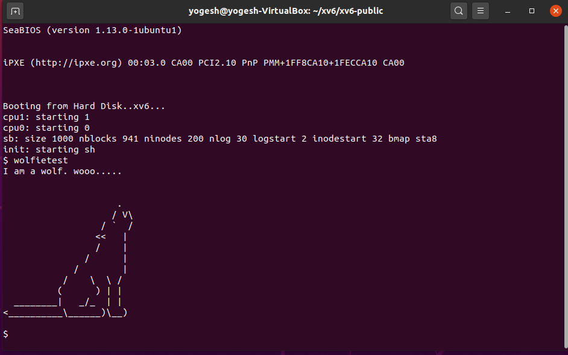

### Exercise 1: Inline Assembly

Refer to file [ex1.c](./ex1.c)

The following inline assembly code will increment the value of x by 1.

```c
asm ("incl %0":"+r"(x));
```
- `incl` instruction increments the operand by 1.
- `+r` is used to allocate any free register to the variable x and use that register as both Input and Output
- `%0` corresponds to the register allocated to x.

---
### Exercise 2: GDB 

A few starting instructions of `BIOS` are:

```assembly
0xffff0:   ljmp   $0x3630,$0xf000e05b
0xfe05b:   cmpw   $0xffc8,%cs:(%esi)
0xfe060:   jo     0xfe062
0xfe062:   jne    0xd241d416
0xfe068:   mov    %edx,%ss
0xfe06a:   mov    $0x7000,%sp
0xfe06e:   add    %al,(%eax)
0xfe070:   mov    $0x2d4e,%dx
0xfe074:   verw   %cx
0xfe077:   xchg   %ebx,(%esi)
0xfe079:   push   %bp
0xfe07b:   push   %di
0xfe07d:   push   %si
0xfe07f:   push   %bx
0xfe081:   sub    $0x70,%sp
0xfe085:   mov    %ax,%di
0xfe088:   mov    0x4(%bx,%si),%si
0xfe08d:   mov    %cs:0x2c(%bp),%bl
0xfe093:   icebp  
0xfe094:   ljmp   *(%esi)
0xfe096:   mov    0x2d(%bp),%al
0xfe09b:   icebp 
```

The `BIOS` first initializes all the PCI bus and all other peripheral devices. Then it loads the `bootloader` from the `hardisk `into memory. Finally with a jump statement control goes to the `bootloader`. 

---

<div style="page-break-after: always;"></div>

### Exercise 3: Loading Kernel from Bootloader

**Trace**: Refer to file [Bootloader Trace.pdf](Bootloader Trace.pdf)

**(a)**  Following instructions change the addressing to 32 bit protected mode.

```assembly
0x7c1d: lgdt   gdtdesc 											# lgdt (%esi)
0x7c22: mov    %cr0,%eax
0x7c25: or     $0x1,%ax
0x7c29: mov    %eax,%cr0
0x7c2c: ljmp   $(SEG_KCODE<<3), $start32    # ljmp $0xb866,$0x87c31
```

After this point processor starts executing 32 bit code. First instructions it executes in 32 bit is:-

```assembly
0x7c31: mov    $0x10,%ax
```

**(b)**  The last instruction that bootloader executed is

```assembly
0x7d87:	call   *0x10018
```

This instructions is calling the entry function found in ELF Header. In `bootmain.c` this corresponds to following lines.

```C
entry = (void(*)(void))(elf->entry);
entry();
```

First instruction of kernel is

```assembly
0x10000c:	mov    %cr4,%eax
```

**(c)** This information is stored in elf header. First the bootloader loads first 4096 bytes (1st page) into memory. This page contains elf header which has an array of program headers. these program headers contains the size and offset of different segments of kernel which are then loaded into memory.

```c
// Load each program segment (ignores ph flags).
ph = (struct proghdr*)((uchar*)elf + elf->phoff);
eph = ph + elf->phnum;
for(; ph < eph; ph++){
  pa = (uchar*)ph->paddr;
  readseg(pa, ph->filesz, ph->off);
  if(ph->memsz > ph->filesz)
    stosb(pa + ph->filesz, 0, ph->memsz - ph->filesz);
}
```

---
<div style="page-break-after: always;"></div>

### Exercise 4: Objdump

> **objdump -h kernel**
>  
> 
>  **objdump -h bootblock.o**
>  

<div style="page-break-after: always;"></div>

`objdump -h` &nbsp; displays the header of an executable file. In this case it displays the contents of program section headers of the ELF Binaries.

The important program sections in an ELF Binary - 
- `.text` - All the executable instructions of the program
- `.rodata` - The read-only data of the program like the ASCII string constants in C.
- `.data` - The initialized global and static variables in the program.
- `.bss` - The uninitialized global and static variables in the program.

Each section has the following information -
- `LMA(Load memory address)` - The address at which the section is actually loaded in the memory.
- `VMA(Virtual memory address)` - The address at which the binary assumes the section will be loaded.
- `Size` - The size of the section.
- `Offset` - The offset from the beginning of the harddrive where the section is located at.
- `Algn` - The value to which the section is aligned in memory and in the file.
- `CONTENTS, ALLOC, LOAD, READONLY, DATA, CODE` - Flags which gives additional information regarding the section. Eg. Is it READONLY, should it be LOADED etc. 


---
### Exercise 5: Bootloader's Link address

If we get wrong `bootloader's` link address, then the 1st instruction that would break is

```assembly
ljmp  $(SEG_KCODE<<3), $start32
```

With correct  `bootloader's` link address the output was:

```assembly
[   0:7c2c] => 0x7c2c:	ljmp   $0xb866,$0x87c31
The target architecture is assumed to be i386
=> 0x7c31:	mov    $0x10,%ax
=> 0x7c35:	mov    %eax,%ds
=> 0x7c37:	mov    %eax,%es
```

The output when `bootloader's` link address is changed to 0x7C04:

```assembly
[   0:7c2c] => 0x7c2c:	ljmp   $0xb866,$0x87c35 
[f000:e05b]    0xfe05b:	cmpw   $0xffc8,%cs:(%esi)
[f000:e062]    0xfe062:	jne    0xd241d416
[f000:d414]    0xfd414:	cli    

```

The `ljmp` instruction breaks because in the `BIOS` the address 0x7C00 is hard coded, so `BIOS` always loads `bootloader` starting from 0x7C00. But the `linker` converts the code into binary form and assigns addresses in place of labels taking `bootloader's `link address(0x7C04) as the starting address of the `bootloader` in the memory. So the address of the label `$start32` in the `ljmp` instruction doesn't contain the correct instruction and this causes some error. Hence the `BIOS` restarts (execution reaches starting instruction of `BIOS`). This process then repeats and in turn leads to an infinite loop.  

The file headers of `kernel` are

```
kernel:     file format elf32-i386
architecture: i386, flags 0x00000112:
EXEC_P, HAS_SYMS, D_PAGED
start address 0x0010000c
```

This shows that entry point of `kernel` is 0x0010000c.

---
### Exercise 6: Inspecting Kernel Loading

After entering the bootloader (at `0x7c00`):
```
(gdb) x/8x 0x00100000
0x100000:	0x00000000	0x00000000	0x00000000	0x00000000
0x100010:	0x00000000	0x00000000	0x00000000	0x00000000
```
After entering the kernel (at `0x10000c`):
```
(gdb) x/8x 0x00100000
0x100000:	0x1badb002	0x00000000	0xe4524ffe	0x83e0200f
0x100010:	0x220f10c8	0x9000b8e0	0x220f0010	0xc0200fd8
```
The code for kernel is stored from memory location `0x00100000`, which is loaded from the disk by the bootloader.

At the point the BIOS enters the bootloader, this loading is not done, hence the main memory does not contain the kernel code. Moreover, it is filled with zeroes because upto this point the system runs in the 20-bit real mode and any memory location from this address onwards is not touched. 

At the point the bootloader enters the kernel, the bootloader has already loaded the kernel and there are instructions from that memory location.

The second breakpoint is the entry point of the kernel. The first intructions starting from this location are responsible for turning on paging (which wasn't enabled upto this point).

---
<div style="page-break-after: always;"></div>

### Exercise 7: Adding System Call

For creating a system call, we need to change 6 files:- [user.h](System Call/user.h),  [syscall.h](System Call/syscall.h), [syscall.c](System Call/syscall.c), [usys.S](System Call/usys.S), [defs.h](System Call/defs.h), [sysproc.c](System Call/sysproc.c)

```C
// user.h 
int wolfie(void* buf, uint size);           // line 26
```

```C
// syscall.h 
#define SYS_wolfie 22                       // line 23
```

```C
// syscall.c
extern int sys_wolfie(void);                // line 106
[SYS_wolfie]  sys_wolfie,                   // line 130
```

```C
// usys.S 
SYSCALL(wolfie)                             // line 32
```

```C
// defs.h 
int wolfie(void*, uint);                    // line 123
```

```C
// sysproc.c
int sys_wolfie(){                           // line 94
	char* buf;
	uint size;
	if(argptr(0, (void*)&buf, sizeof(buf)) < 0) return -1;
	if(argptr(0, (void*)&size, sizeof(size)) < 0) return -1;
	
	static char wolf[] = \
"                         \n"
"                     .    \n"
"                    / V\\  \n"
"                  / `  /  \n"
"                 <<   |   \n"
"                 /    |   \n"
"               /      |   \n"
"             /        |   \n"
"           /    \\  \\ /    \n"
"          (      ) | |    \n"
"  ________|   _/_  | |    \n"
"<__________\\______)\\__)   \n"
"                          \n";
  
    static uint wolf_len = sizeof(wolf);
    if(size < wolf_len) return -1;
    
    int i = 0;
    while(wolf[i] != '\0'){
     	buf[i] = wolf[i];
    	++i;
    }
    buf[i] = '\0';
    
    return wolf_len;
}
```
---
### Exercise 8: User Level Application

We created [wolfietest.c](System Call/wolfietest.c) in which we created a buffer and used system call to fill that buffer with wolf ASCII image. Then we printed this buffer to console using `printf`. 1st parameter in `printf` is file descriptor which is 1 for console out. At the end we used `exit` system call to exit from this program.

```C
// wolfietest.c
#include "types.h"
#include "user.h"

int main(int argc, char *argv[]){
	printf(1, "I am a wolf. wooo.....\n\n");
	char wolf[500];
	wolfie(wolf, 500);
	printf(1, wolf);
	exit();
}
```

In [Makefile](System Call/Makefile) we need to add `_wolfietest\` to `UPROGS` and `wolfietest.c` to `XTRA	`.

```makefile
// Makefile
UPROGS=\
	_cat\
	_echo\
	_forktest\
	_grep\
	_init\
	_kill\
	_ln\
	_ls\
	_mkdir\
	_rm\
	_sh\
	_stressfs\
	_usertests\
	_wc\
	_zombie\
	_wolfietest\                                                               # line 184
	
XTRA=\
	mkfs.c ulib.c user.h cat.c echo.c forktest.c grep.c kill.c\
	ln.c ls.c mkdir.c rm.c stressfs.c usertests.c wc.c zombie.c wolfietest.c\  # line 251
	

```

> **Output**
> 
